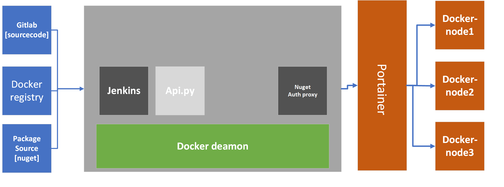
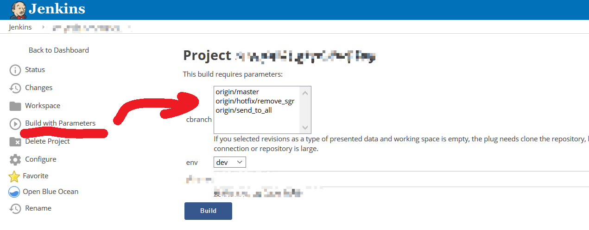

# 开发部署流程进化史

## 引言
想要提高开发团队效率，势必要有一套完整而成熟的开发流程方案，除了sprint迭代开发模式之外,还有近几年流行的devops流程,都是可以大幅度提高开发效率的工具.
我们团队也不断探索、实践，最终形成了现有的一套体系，从最初的手动发布到现有的自动化，从起始的繁琐易乱到当下的简洁明了。我们希望将我们曾经踏过的脚印与大家一起分享，为各位展示一条 devops 的实践之路，同时也希望能为各位避免走入同样的弯路提供些许帮助。  

## 背景
我们是一个 `.net(core)` / `go` / `nodejs` 的多语言混合式开发团队，致力于微服务架构。我们的 `.net` 开发小组初期基于 `.net framework` 进行开发，起初并没有准备做 `devops`，因为基于`Windows`的 `grpc 服务`、`ASP.NET` 做持续部署（即`CD`/`continue deployment`）比较麻烦（不管是停止远程服务/更新二进制包/docker化流程都太重）。当全面转型 `.net core` 之后，其原生跨平台的特性促成了我们的 `CI/CD (continue integration/continue deployment)` 之路。  


## 发展历程
```
我们经历过的阶段
```

### 1 原始阶段/纯人工管控
* **操作方式**  
  -  项目负责人负责打包发布文件
  -  人工将打包好的工程文件上传至服务器，并进行更新。
* **存在的问题**
  -  分布式系统下，一个服务可能需要署到多台服务器上；人工完成此类操作容易操作失误，而且效率不高;
  -  每次发布更新，都需要将完整的包传输至远程服务器，若安装包体积较大，会极大程度上受限于网络条件；若手动发布增量更新，出错率会进一步增加。
  -  随者服务增加,环境增加, 部署成本指数上升。假设当存在多个服务（假设50个），多个运行环境（假设有dev/test/prod），每个运行环境有多台服务器（假设20台）。那么，如何能够快速找到某个环境下的某个服务被部署到了哪几台服务器上的那些目录中呢？仅在此例中，它们所有的组合情况就多达 `3000` 种！

### 2 Ansible + git
- 通过ansible 脚本,可以实现一件发布更新到多台服务器的问题, 这个时候已经可以解决大量的手工操作了
- 上面的发布更新包的问题, 可以基于git做到增量更新的效果,而且rollback更加简单
- 此时开发人员还是需要build 二进制包git化

### 3. devops
```devops才是我们最终要走向的路```
为了实现开发自运维,我们也是刚开始的时候把prod服务器权限给部分开发者,可是新的问题来了,我们如何确保开发只操作了他负责项目的东西呢? 是的, 我们确保不了! ,那我们也就无法开放发布权限给所有人..

#### docker
> 引入docker注意是为了解决2个问题
- 环境依赖, 例如 .net core 版本/ OS 版本 ..
- 资源限制, 例如有些服务存在内存泄漏/CPU问题, docker可以限制他的最大使用率, 确保其他docker 服务可以正常使用

#### docker portainer
> 在开放ssh权限的时候, 如何确保开发只操作了他负责项目的东西呢? 我们确保不了! , 在docker化之后, 我们可以使用portainer来减低出错率; 有了portainer之后, 就已经实现了开发人员自己发布的所有条件了, 不过此时的开发人员还需要人工解决 build-二进制软件包-> build-doker-image -> push-docker-image -> 在portainer上进行UI操作


####  Jenkins + Docker + Portainer
```如下就是我们的解决方案```

- jenkins 连接了gitlab 来做软件二进制包build的动作
- jenkins 连接了docker-register, 来解决build docker image ,docker push ...
- Jenkins 连接portainer, 来实现build->deploy 一条龙服务

  

## work-flow
```
来, 我们来模拟一下修复一个线上的紧急bug,我们需要几步
```

- git checkout -b hotfix 
- coding /testing /push
- jenkins-UI /选择相应的环境, 分支, 进行CICD 
- done ;服务已更新!

在整个过程中, 开发只需要关注代码的变更/ 关注发布的环境, UI构建发布到相应的服务
 


## 有问题欢迎大家issue提问

## demo地址:
    todo
    
